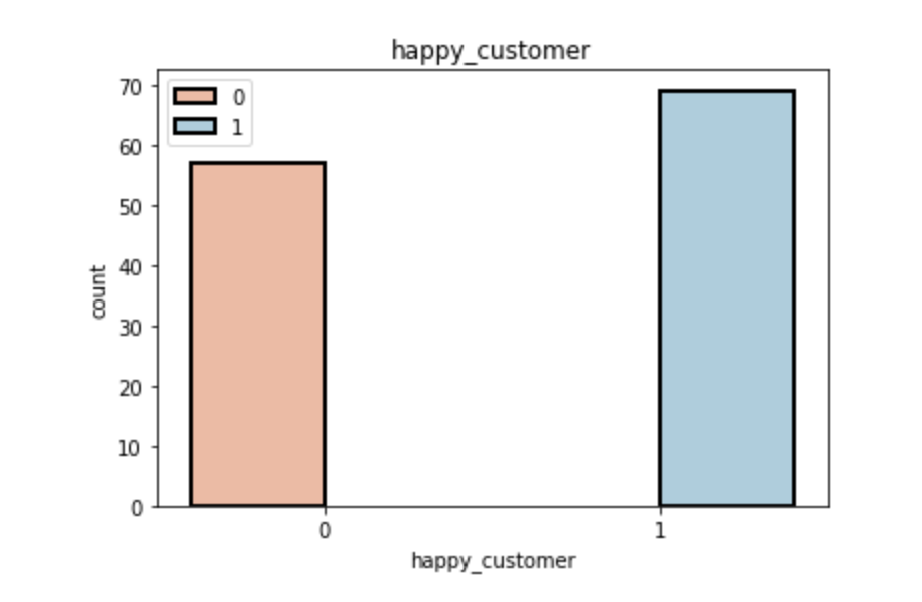

 
 <h1 style="font-size:300%;"> Happy Customers</h1>

<!-- ABOUT THE PROJECT -->
## About The Project

The objective of this [data](https://drive.google.com/file/d/1KWE3J0uU_sFIJnZ74Id3FDBcejELI7FD/view) is to predict whether the customer is satisfied with the provided services or not based on different characteristics as shown in the following table:

<table >
  <tr>
    <th style = 'text-align: center'>Column</th>
    <th style = 'text-align: center'>Meaning</th>
  </tr>
  <tr>
    <td style = 'text-align: center'>Y</td>
    <td style = 'text-align: left'>target attribute (Y) with values indicating 0 (unhappy) and 1 (happy) customers</td>
  </tr>
  <tr>
    <td style = 'text-align: center'>X1</td>
    <td style = 'text-align: left'>my order was delivered on time</td>
  </tr>
  <tr>
    <td style = 'text-align: center'>X2</td>
    <td style = 'text-align: left'>contents of my order was as I expected</td>
  </tr>
  <tr>
    <td style = 'text-align: center'>X3</td>
    <td style = 'text-align: left'>I ordered everything I wanted to order</td>
  </tr>
  <tr>
    <td style = 'text-align: center'>X4</td>
    <td style = 'text-align: left'>I paid a good price for my order</td>
  </tr>
  <tr>
    <td style = 'text-align: center'>X5</td>
    <td style = 'text-align: left'>I am satisfied with my courier</td>
  </tr>
    <tr>
        <td style = 'text-align: center'>X6</td>
        <td style = 'text-align: left'>the app makes ordering easy for me</td>
      </tr>
</table>

**Attributes X1 to X6 indicate the responses for each question and have values from 1 to 5 where the smaller number indicates less and the higher number indicates more towards the answer.**

### The data is almost balanced as shown in the image below

**z1KZ0UEezVIom3ut**
